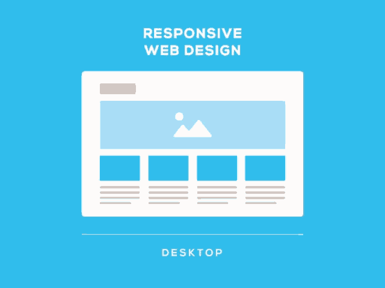

# Introduction to Responsive Web Design

## Learning Outcomes

By the end of this lesson, you should be able to:

- Understand the concept of responsive web design and its importance in modern web development.
- Describe how media queries work and their role in enabling websites to adapt to different devices.
- Demonstrate the ability to create a basic responsive navigation menu using media queries.
- Identify and explain the key components of a responsive webpage, including breakpoints.

## Table of Contents

- [What is Responsive Web Design?](#what-is-responsive-web-design)
- [The Importance of Responsive Design](#the-importance-of-responsive-design)
- [Media Queries: Adapting to Different Devices](#media-queries-adapting-to-different-devices)
- [Determining Breakpoints for Media Queries](#determining-breakpoints-for-media-queries)


## What is Responsive Web Design?


Responsive web design is a fundamental approach to creating websites that adapt and respond fluidly to various screen sizes and devices. In today's digital landscape, where users access websites on devices ranging from smartphones and tablets to laptops and large desktop monitors, responsive design is essential for delivering a seamless and optimized user experience.



At its core, responsive design seeks to ensure that a website's layout, content, and functionality remain consistent across different devices, without requiring users to zoom in or navigate through horizontal scrolling. By employing flexible grids, fluid images, and CSS media queries, designers and developers can create websites that automatically adjust their presentation to fit the screen dimensions and orientation of the device being used.


## The Importance of Responsive Design

Responsive design plays a pivotal role in modern web development due to its numerous benefits and the evolving landscape of user behavior. Here are some key reasons why responsive design is of paramount importance:

### 1. **Enhanced User Experience**

Responsive design ensures that users have a consistent and user-friendly experience regardless of the device they are using. This eliminates the frustration of poorly rendered websites, excessive zooming, and horizontal scrolling.

### 2. **Wider Audience Reach**

With the proliferation of smartphones and tablets, people access websites on a variety of devices. A responsive website guarantees that your content reaches a wider audience, enhancing engagement and potential conversions.

### 3. **SEO Benefits**

Responsive websites often rank better in search engine results. Search engines like Google prefer responsive sites because they provide a unified experience across devices, making it easier for their algorithms to crawl, index, and rank content.

### 4. **Simplified Maintenance**

Managing multiple versions of a website for different devices can be time-consuming and error-prone. Responsive design streamlines maintenance efforts, as there's only one version of the site to update and manage.

### 5. **Future-Proofing**

As new devices with varying screen sizes and resolutions emerge, responsive design ensures that your website will adapt gracefully to future technologies without requiring a complete overhaul.


[Non-Responsive Design Example #1](https://dequeuniversity.com/library/responsive/1-non-responsive#)

[Non-Responsive Design Example #2](https://www.milehighcomics.com/)


## Media Queries: Adapting to Different Devices

Media queries are a core component of responsive web design, enabling websites to adapt their layout and styles based on the characteristics of the device and screen size. With media queries, designers and developers can apply specific CSS rules to different breakpoints, ensuring that the website's content and design remain optimal across various devices.

### How Media Queries Work
Media queries work by evaluating the characteristics of the user's device, such as screen width, height, and orientation. When a user accesses a website, the browser interprets the media queries defined in the CSS and applies the corresponding styles based on the device's properties. This allows websites to provide a tailored experience for each device category.

### Defining Media Queries
Media queries are defined using the @media rule in CSS. Each media query includes a set of conditions, known as media features, that target specific device properties. When the conditions of a media query are met, the associated styles are applied. For example, a media query might target devices with a maximum screen width of 768 pixels:


### Common Media Features in Media Queries

Some common media features used in media queries include:

- **max-width and min-width:** These media features define the maximum and minimum screen width for the styles to apply.
```css
@media (max-width: 768px) {
  /* Styles applied when the screen width is 768px or less */
}
```
- **max-height and min-height:** These are similar to max-width and min-width but for screen height.
```css
@media (min-height: 600px) {
  /* Styles applied when the screen height is at least 600px */
}
```
- **orientation:** This media feature specifies the orientation of the device, either portrait or landscape.
```css
@media (orientation: landscape) {
  /* Styles applied when the device is in landscape orientation */
}

```
- **device-width and device-height:** These media features target the actual width and height of the device's screen.
```css
@media (device-width: 320px) {
  /* Styles applied when the device width is 320px */
}
```

Media queries allow you to create responsive designs by applying styles based on these and other device characteristics. By utilizing these media features effectively, you can ensure that your web content looks and functions well across a variety of devices and screen sizes.

### Quick Demo

Let's put theory into practice. We're going to adjust background colors as we resize the screen. This hands-on exercise will give you a feel for how media queries work in real-time. Ready to give it a try?


### Breakpoints and Responsive Design

Media queries allow designers to set breakpoints, which are specific screen widths at which the layout and styles of the website change. By strategically choosing breakpoints, developers can ensure that the website looks and functions well across a range of devices. For instance, a responsive website might have breakpoints for mobile, tablet, and desktop views.

### Implementing Media Queries

To implement media queries effectively, it's important to follow best practices:

- Start with a mobile-first approach: Design and develop the mobile version of the site first, and then enhance the layout and styles for larger screens.
- Use relative units: Use relative units like percentages or em to ensure that elements scale smoothly across different devices.
- Test thoroughly: Test the website on various devices and screen sizes to ensure that the layout remains consistent and visually appealing.

Media queries are a cornerstone of responsive design, enabling websites to provide a seamless experience across devices of all sizes. By harnessing the power of media queries, designers can create websites that adapt gracefully and deliver a user-friendly experience to a diverse audience.


## Determining Breakpoints for Media Queries

When creating responsive designs, it's important to set breakpoints in your media queries to adapt the layout and styles for different screen sizes. Here are some common screen widths for different devices along with suggested breakpoints:

1. **Mobile Phones:**
   - Screen Width: Less than 576px
   - Suggested Breakpoint: 576px

2. **Small Tablets (e.g., iPad Mini):**
   - Screen Width: 576px - 767px
   - Suggested Breakpoint: 768px

3. **Tablets and Small Laptops (e.g., iPad, Microsoft Surface):**
   - Screen Width: 768px - 991px
   - Suggested Breakpoint: 992px

4. **Desktops and Laptops:**
   - Screen Width: 992px - 1200px
   - Suggested Breakpoint: 1200px

5. **Large Desktops and Monitors:**
   - Screen Width: 1200px and above

Remember, these are suggested breakpoints based on a "mobile-first" approach. However, you can adjust these breakpoints based on your design's needs and the content layout. It's important to test your responsive design on various devices to ensure optimal usability and user experience.

